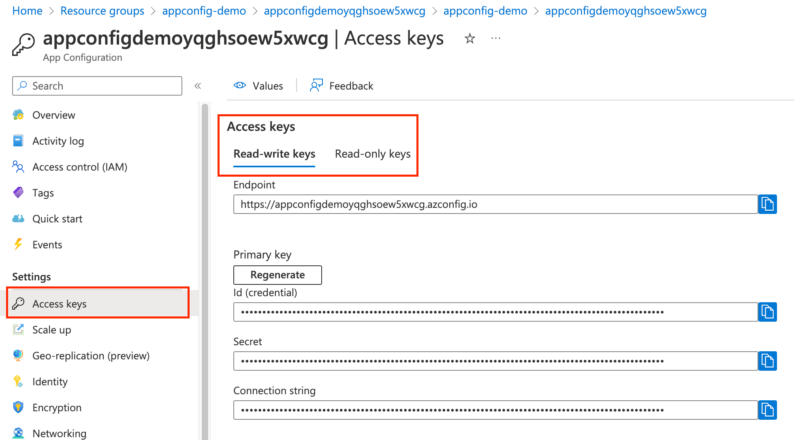
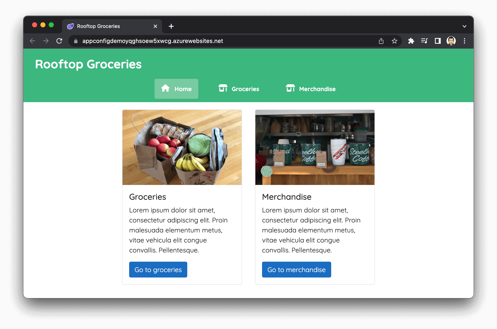
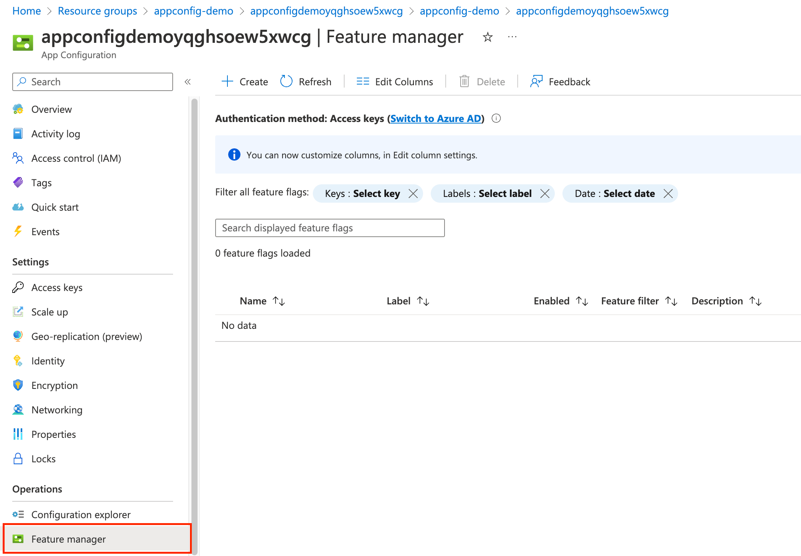
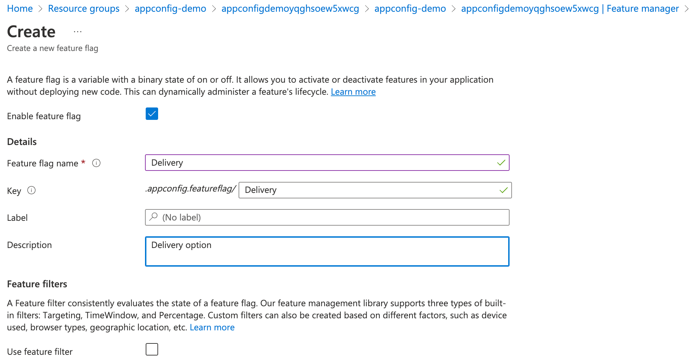
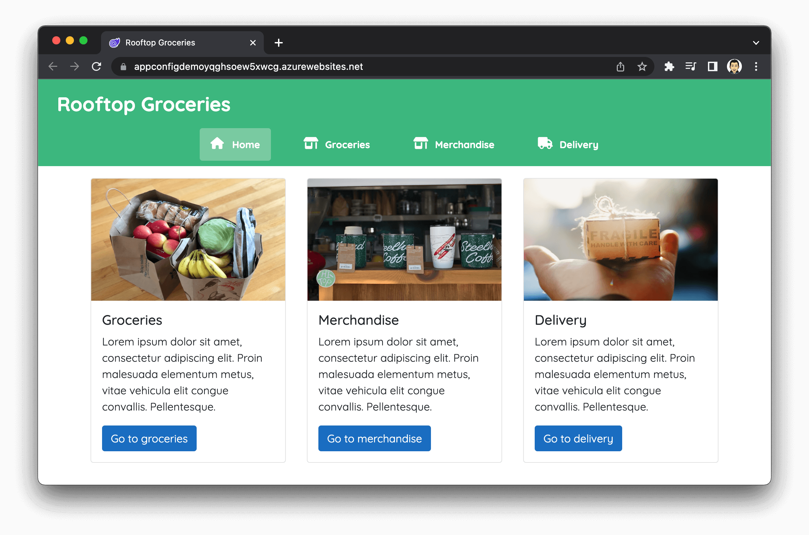
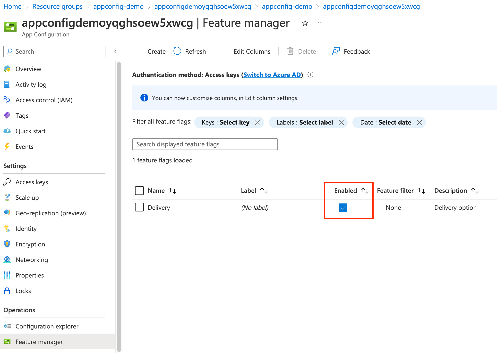

# Azure App Configuration - Feature Management Demo
Azure App Configuration allows you to store and manage all feature flags from a single place.

The following will show you how to:
* Deploy the required Azure resources.
* How the sample code accesses the feature flags.
* Define and manage feature flags in App Configuration.

## Setup
### Create a resource group
Create a resource group using the following CLI command. Substituting the resource group name for the name used above, location for your preferred option.

```bash
az group create --resource-group <RESOURCE-GROUP-NAME> --location <LOCATION>
```
### Deploy azure Bicep files

```bash
az deployment group create --resource-group <RESOURCE-GROUP-NAME> --template-file main.bicep
```

### Deploy the Blazor Server website
This isn't necessary as you can run the sample code locally. If you do with to deploy the site to the App Service that was created above, there are many ways of deploying the website, so feel free to pick your prefered way.

Blazor Server is used rather than Blazor WASM because App Configuration is not currently supported in WASM.

## App Configuration - Feature Flags
Feature flags are used within software engineering as a way to turn functionality on and off during runtime. For example, you may have developed a feature that can be deployed, but the company isn't quite ready for it to be used yet. You could therefore add a feature flag so that it is initially off in production, and then when the company is ready, it is just a case of "flipping a switch".

Feature flags can also be used for the following reasons as well:
* Code branch management - Functionality that is currently under development could safely be deployed to production on an off state rather than having a long-running branch.
* Test in production - Functionality could be enabled for just testers so that they can get a real feel for how the feature will behave in the production environment.
* Flighting - Feature flags can be used to incrementally roll out new functionality to users.
* Rollback - If an issue is found, then the functionality can quickly be switched off without having to do a new deployment.

### Feature Flag repository
When managing feature flags, you want a centralised place that allows their management. This is so that you don't have to deploy a new version of the code just to change a feature flag.

Azure App Configuration gives this ability by providing a centralised repository. You can use it to define different kinds of feature flags and manipulate their states quickly and confidently.

### Enabling feature flags in your application
.NET includes Feature Management libraries that allow you to add feature flags quite easily. The libraries also manage the feature flag lifecycles behind the scenes so that you don't need to write additional code to refresh their state.

In the sample code, the App Configuration store is configured in `Program.cs`. To connect to the store, you can use the following code:

```csharp
builder.Configuration.AddAzureAppConfiguration(options =>
    {options.Connect(builder.Configuration["AppConfigurationConnectionString"]).UseFeatureFlags();
});
```
Azure App Configuration gives you keys for read-write and read-only. In this sample, the latter is used to keep permissions to just those that are required.



Note - The sample code stores the connection string in a Key Vault. The Key Vault is then added as a configuration provider. This is to add better security around secrets rather than storing them in configuration files.

The final step is to add the App Configuration middleware and feature management to the container services.

```csharp
builder.Services.AddAzureAppConfiguration().AddFeatureManagement();
```

Also

```csharp
app.UseAzureAppConfiguration();
```

### Using feature flags on pages
To use the feature flags that are stored in a centralised App Configuration store and being managed by the container services in your pages, you need to add the following at the top neat the `@page1 directive.

```csharp
@using Microsoft.FeatureManagement
@inject IFeatureManager FeatureManager
```

It is then just a case of the value of the feature flag that you need.

```csharp
@code {

    private bool _isDeliveryEnabled;
  
    protected override async Task OnInitializedAsync()
    {
        _isDeliveryEnabled = await FeatureManager.IsEnabledAsync("Delivery");
    }

}
```

There are many other ways you could do this, so maybe take some time to look at the official [documentation](https://learn.microsoft.com/en-us/azure/azure-app-configuration/quickstart-feature-flag-aspnet-core?tabs=core6x).

## Example
If you have followed through the deployment steps above, you should see a page that looks like the following when navigating to the App Service URL.



At the moment, the feature flag does not exist in the App Configuration resource. To create this, navigate to the App Configuration resource that has been created, and the Feature Mangement blade.



Next click on `Create` and fill in the new feature flag options as follows

| Option                   | Value |
| -----------              | -----------                          |
| Enable feature flag      | true (ticked)                        |
| Feature flag name        | Delivery                             |
| Key                      | (Auto populated from the above name) |
| Label                    | (Leave blank)                        |
| Description              | Delivery option                      |

You should have something that looks like this:



Then just click `Apply` and you should see your newly created feature flag.

If you navigate to the App Service URL again, or just refresh the page if you still have it open, you should see the new Delivery option on the site.



To show how the feature flag can be managed going forwards, you can disable and enable the `Delivery` feature flag in the App Configuration store and refresh the page to see the feature being turned off and on.

Just bear in mind that the default refresh time is 30 seconds. So if you refresh and don't notice any change, you will need to wait up to 30 seconds.



Therefore showing how features can be turned on and off from a centralised location, without deploying a new version of the code.

## Clean up
The following samples will build on the above. IF you wish to delete the resource group created and all resources within, you can run the following command.

```bash
az group delete --name <RESOURCE-GROUP-NAME>
```